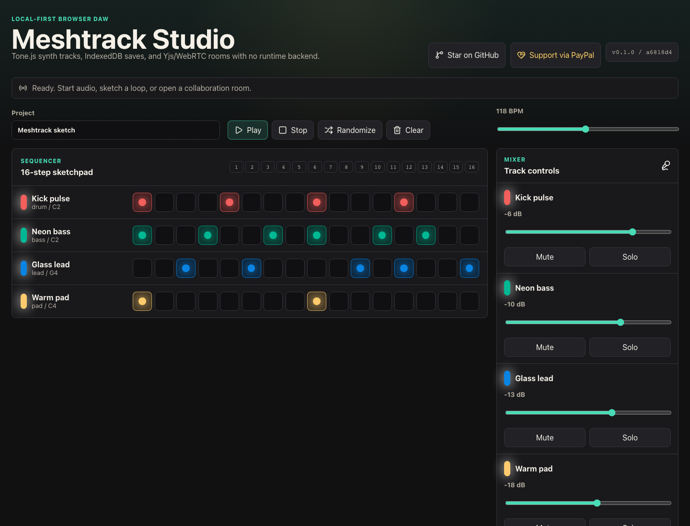
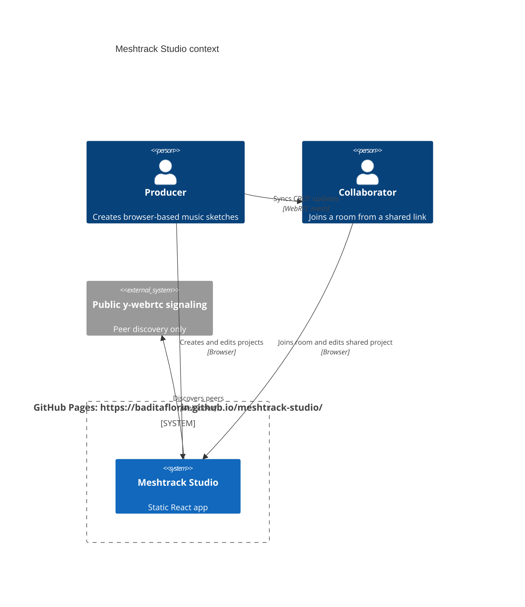

# Meshtrack Studio


Live site: https://baditaflorin.github.io/meshtrack-studio/

Repository: https://github.com/baditaflorin/meshtrack-studio

Support: https://www.paypal.com/paypalme/florinbadita

Meshtrack Studio is a local-first browser DAW for quick collaborative sketches: Tone.js handles synth playback, IndexedDB keeps projects on-device, and Yjs plus WebRTC syncs edits between peers without a project-owned runtime backend.



## Quickstart

```bash
git clone https://github.com/baditaflorin/meshtrack-studio.git
cd meshtrack-studio
npm install
make install-hooks
make dev
```

## What Works

- Four-track 16-step sequencer with synth, bass, pad, and drum voices.
- Transport, tempo, randomize, clear, mute, solo, and per-track volume controls.
- Local autosave, manual save, JSON export, and JSON import through IndexedDB.
- WebRTC collaboration rooms using Yjs shared state.
- GitHub Pages production build from `main` plus `/docs`.
- PWA manifest and best-effort offline service worker.
- Visible version and commit on the live page.

## Architecture



More detail: docs/architecture.md

ADRs: docs/adr/

Deploy guide: docs/deploy.md

Privacy notes: docs/privacy.md

Postmortem: docs/postmortem.md

## Commands

```bash
make help
make lint
make test
make build
make smoke
make pages-preview
```

## Release

Version is managed in `package.json`. A release tag such as `v0.1.0` marks the static Pages version; no Docker image is produced because ADR 0001 chooses Mode A.
