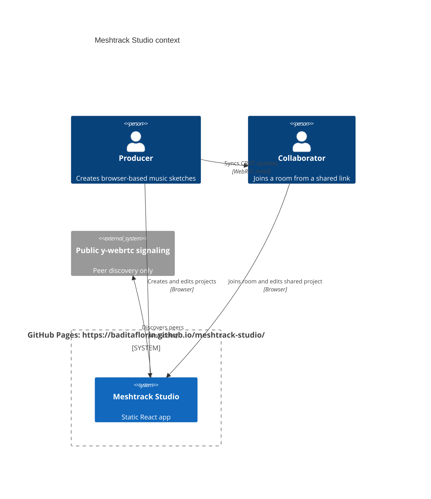

# Meshtrack Studio


Live site: https://baditaflorin.github.io/meshtrack-studio/

Repository: https://github.com/baditaflorin/meshtrack-studio

Support: https://www.paypal.com/paypalme/florinbadita

Meshtrack Studio is a local-first browser DAW for quick collaborative sketches: Tone.js handles synth playback, IndexedDB keeps projects on-device, and Yjs plus WebRTC syncs edits between peers without a project-owned runtime backend.


## Quickstart

```bash
git clone https://github.com/baditaflorin/meshtrack-studio.git
cd meshtrack-studio
npm install
make install-hooks
make dev
```

## What Works

- Four-track 16-step sequencer with synth, bass, pad, and drum voices.
- Transport, tempo, randomize, clear, mute, solo, per-track sound, note, and volume controls.
- Persistent master FX and scale settings that survive save, export, import, and reload.
- Local autosave, manual save, new-project reset, clear-local-save, JSON export, and tolerant JSON import through IndexedDB.
- Drag-drop, file, pasted-text, clipboard, and share-link project import flows.
- Downloadable JSON export, clipboard JSON copy, and project snapshot share links.
- WebRTC collaboration rooms using Yjs shared state.
- GitHub Pages production build from `main` plus `/docs`.
- PWA manifest and best-effort offline service worker.
- Visible version and commit on the live page.

## Architecture



More detail: docs/architecture.md

ADRs: docs/adr/

Deploy guide: docs/deploy.md

Privacy notes: docs/privacy.md

Postmortem: docs/postmortem.md

Phase 2 substance notes: docs/postmortem-phase2-substance.md

Phase 3 audit: docs/phase3/findings.md

## Commands

```bash
make help
make lint
make test
make build
make smoke
make pages-preview
```

## Release

Version is managed in `package.json`. A release tag marks the static Pages version; no Docker image is produced because ADR 0001 chooses Mode A.

## Limitations

- Collaboration room links connect live peers; they are different from project snapshot links.
- Project share URLs are convenient for sketches, not large binary assets.
- The app is still a lightweight browser sketchpad, not a full production DAW with MIDI, arrangement view, or sample editing.
