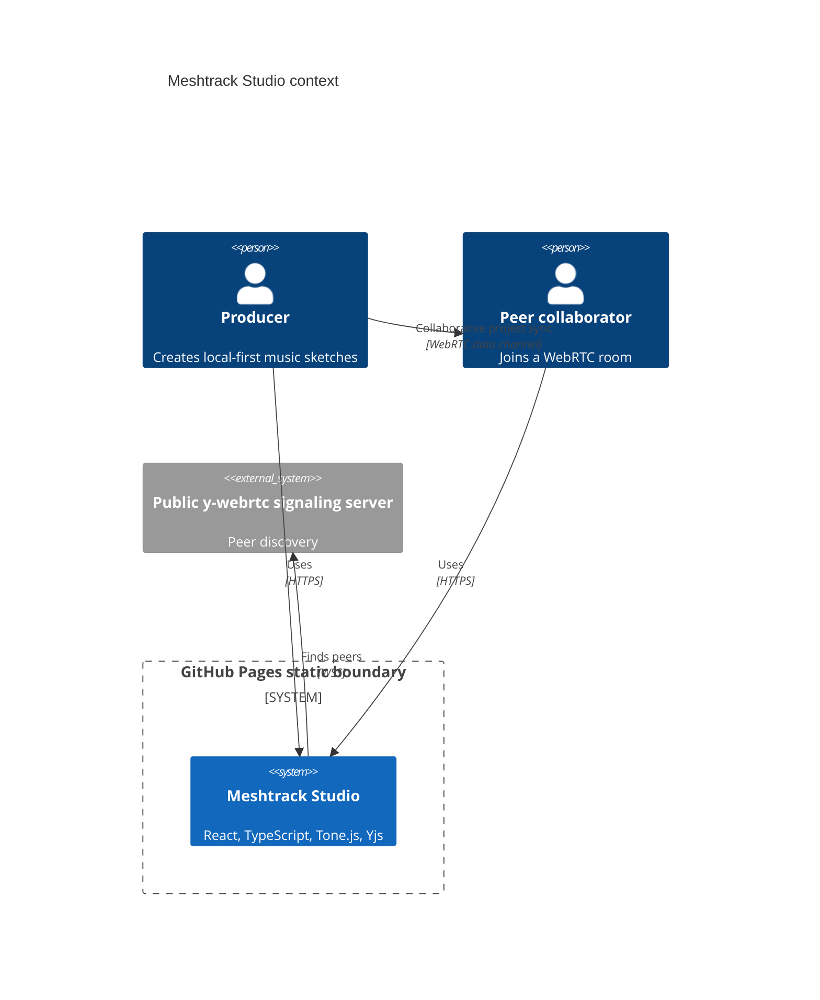
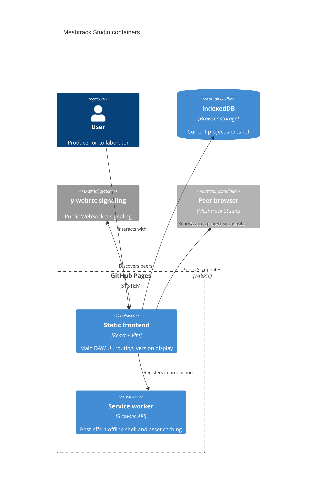

# Architecture

Live site: https://baditaflorin.github.io/meshtrack-studio/

Repository: https://github.com/baditaflorin/meshtrack-studio

## Context

## Containers

## Module Boundaries

- `src/features/studio` contains the versioned project schema and pure state mutations.
- `src/features/audio` lazy-loads Tone.js and owns playback scheduling.
- `src/features/storage` owns IndexedDB load, save, import, and export.
- `src/features/collaboration` lazy-loads Yjs and `y-webrtc`.
- `src/lib` contains app metadata injected at build time.

## GitHub Pages Boundary

The only deployed runtime is static content under `docs/`, served from `main` plus `/docs`. There is no private API, no database, no Docker image, and no nginx host in v1.
